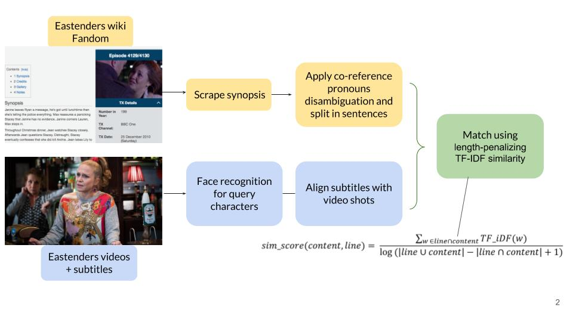

Please cite the following if you use this code.
```
@inproceedings{harrando2020using,
  title={Using Fan-Made Content, Subtitles and Face Recognition for Character-Centric Video Summarization},
  author={Harrando, Ismail and Reboud, Alison and Lisena, Pasquale and Troncy, Rapha{\"e}l and Laaksonen, Jorma and Virkkunen, Anja and Kurimo, Mikko and others},
  booktitle={International Workshop on Video Retrieval Evaluation},
  year={2020}
}
```

# trecvid-vsum
Steps to reproduce the final MeMAD approach for the TRECVID VSUM 2020 task


1) Scraping synopses and casting information from the pages of the [EastEnders fandom wiki](https://eastenders.fandom.com/wiki/) using
[`scraping/scraping_wikia.py`](./scraping/scraping_wikia.py).
The script is standalone and only requires the two included XML files (episode code to file name mapping + episdoe descriptions). 
The output is a pickle of dictionary ('episodes_data.pickle') Requirements: installing BeautifulSoup `pip install bs4`.


2) Perform coreference on the pickle file you just created ('episodes_data.pickle') to explicit character mentions using [`coref/coref.ipynb`](./coref/coref.ipynb) created from [neuralcoref](https://github.com/huggingface/neuralcoref). Outputs 'coref_results.pickle'
3) Face recognition :
We select the shots displaying any of the the three characters of interests, keeping only those detection having a confidence scoregreater than 0.5.
In order to do so, we performed face recognition using our [Face Recognition Service](https://github.com/D2KLab/FaceRec). The results can be found under [facerec_out](./facerec_out). Note : this folder also includes facerec results for a larger pool of EastEnders characters, which experimented with but did not use in the final submission.  
5) Generate the summaries with [`submission/submission_generation.ipynb`](./submission/submission_generation.ipynb)

Experiments not included in the final approach for TRECVID VSUM 2020 task : 

1) Concatening subtitles with automatically generated captions, see [`captions`](./captions)
2) Diarization of the video segments, see [`diarization`](./diarization)


